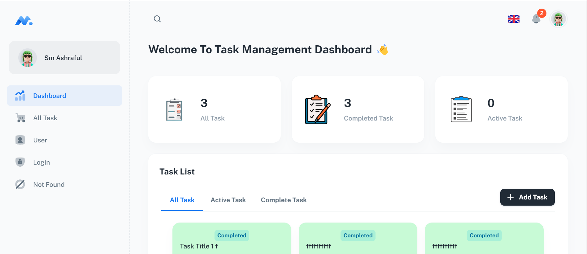

## Task-01: Building a Task Management Dashboard (Using Admin Dashboard Template)

>Task Management Dashboard by using minimal-kit-react template.

---

## Quick start

- [Download from Github](https://github.com/Sm-Ashraful/Task-Management-Dashboard) or clone the repo : `git clone https://github.com/Sm-Ashraful/Task-Management-Dashboard.git`
- Recommended `Node.js v18.x`.
- **Install:** `yarn install`
- **Start:** `yarn dev`
- **Build:** `yarn build`

---

### Description
- This project is a task management application built using the Minimal Kit React admin template. It allows users to efficiently manage their tasks with a user-friendly interface. The application incorporates various features including task listing, addition, updating, completion, and deletion, along with filtering capabilities. Below are the key functionalities implemented:

## Key Feature

### 1.Task Management:
- View a comprehensive list of your tasks with titles, descriptions, and due dates.
- Seamlessly mark tasks as completed for better organization.
- Effortlessly delete tasks you no longer need.
### 2.Task Creation:
- Effortlessly add new tasks using a dedicated form.
- Ensure data integrity with client-side validation.
### 3.Task Editing:
- Update task details with ease, promoting flexibility.
- Leverage modals and in-place editing for a smooth user experience.
### 4.Task Completion Tracking:
- Clearly distinguish between active tasks and completed tasks with distinct visual styles.
- Maintain focus on active tasks while keeping completed tasks readily accessible.
### 5.Task Filtering:
- Apply filters to view only active tasks, completed tasks, or all tasks at once.
- Enhance your task management efficiency with flexible viewing options.

---

## Technologies Used:
- React
- Redux-Toolkit
- React-Hook-Form
- Redux-persist
- Material-UI
- HTML5
- CSS3
- framer-motion
## License

Distributed under the MIT License.

## Contact us

Email: smashraful.dev@gmail.com
